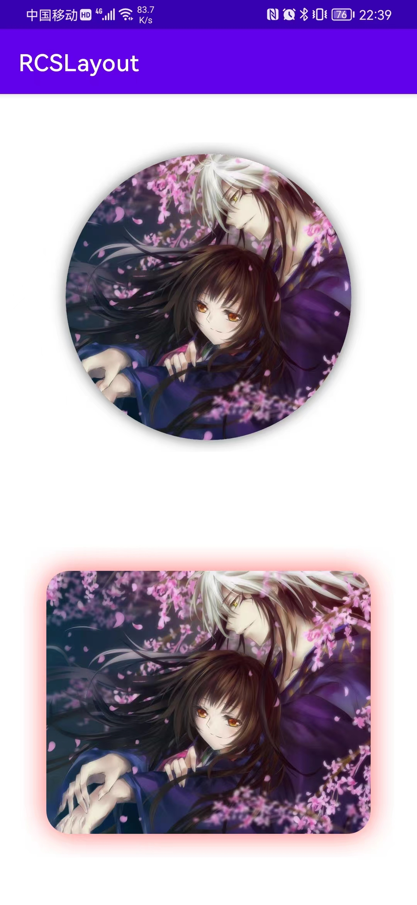

# RCSLayout

[](https://jitpack.io/#yangsanning/RCSLayout)
[](https://android-arsenal.com/api?level=21)

## 效果预览

| RCSLayout                                    |
| -------------------------------------------- |
|  |


## 属性([Attributes](https://github.com/yangsanning/RCSLayout/blob/master/rcslayout/src/main/res/values/attr_rcs.xml))


## 添加方法

### 添加仓库

在项目的 `build.gradle` 文件中配置仓库地址。

```android
allprojects {
	repositories {
		...
		maven { url 'https://jitpack.io' }
	}
}
```

#### 添加项目依赖

在需要添加依赖的 Module 下添加以下信息，使用方式和普通的远程仓库一样。

```android
implementation 'com.github.yangsanning:RCSLayout:1.0.0'
```